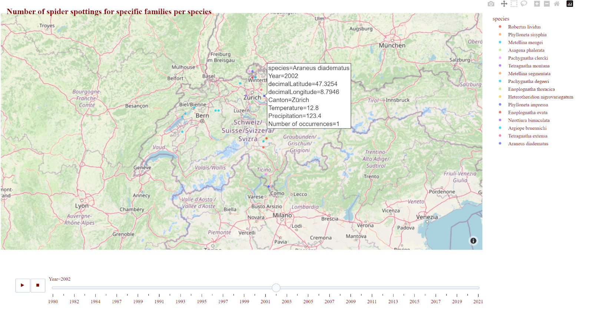

# Geospatial Data Analysis Project

Geospatial Data Analysis of Spider Biodiversity in Switzerland
Exploring Changes in Spider Species Distribution and its Relationship with Average Temperature

## Project Intro/Objective
This paper aims to analyze the geospatial data of spider biodiversity in Switzerland obtained from the Global Biodiversity Information Facility (GBIF) website. The research project focuses on examining changes in the distribution of spider species over a period of 125 years (1896-2021) and investigates the possible correlation between species distribution and average temperature. By addressing these research questions, the paper explores the policy dimensions related to biodiversity conservation and climate change adaptation strategies. The freely available data from GBIF provides a valuable resource for this geospatial analysis, allowing the examination of long-term trends in spider species composition in relation to temperature variations.

The map we aim to produce is intended to illustrate the distribution of spider species across Switzerland from 1896 to 2021. By spatially depicting the instances of spider species, we can visualize the evolving patterns of species composition throughout the nation. The map will integrate various layers, representing species richness, the presence of specific species, and average temperature data corresponding to different months, in line with the corresponding years. This will enable us to demonstrate changes in spider distribution in relation to temperature fluctuations over time, leading to the primary research question of our project:
Has the composition of spider species in Switzerland changed between 1896 and 2021, and is there a correlation between the distribution of spider species and average temperature fluctuations?

## Streamlit app
Unfortunately it keeps crashing due to the size of the data. 
In case you would like to run it on your local machine here are the steps:
1. Clone the repository on your local machine.
2. Create a python environment.
3. Install the packages required by running this command
      pip install -r requirements.txt
4. Run the streamlit app using this command app.py should include the path to the file:
      streamlit run app.py

### Methods Used
* Data Visualization
* Predictive Modeling
* Statistical Analysis

### Technologies
* Python
* Pandas, jupyter
* Streamlit
* Google Colab
* json
* seaborn and matplotlib for simple graphs and plotly for interactive graphs and maps.
* scipy.stats
* Sklearn 

### Data and References 

Spider data:
GBIF.org (21 April 2023) GBIF Occurrence Download  
https://doi.org/10.15468/dl.vx4myr

Temperature data:
Long-time homogeneous series of monthly temperature averages and the total amount of precipitation from the climate stations of the Swiss national basic climatological network (Swiss NBCN). https://www.meteoswiss.admin.ch/services-and-publications/applications/ext/climate-tables-homogenized.html 

Geographical Scope:
Long-term change in drivers of forest cover expansion: an analysis for Switzerland (1850-2000) https://www.researchgate.net/publication/316489074_Long-term_change_in_drivers_of_forest_cover_expansion_an_analysis_for_Switzerland_1850-2000 

The climate of Switzerland https://www.meteoswiss.admin.ch/climate/the-climate-of-switzerland.html 

Geography – Facts and Figures of Switzerland https://www.eda.admin.ch/aboutswitzerland/en/home/umwelt/geografie/geografie---fakten-und-zahlen.html 

Wikipedia 
https://en.wikipedia.org/wiki/Geography_of_Switzerland#Climate 

